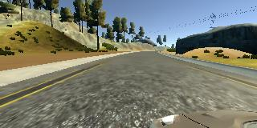
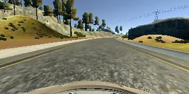
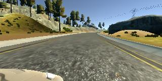

# **Behavioral Cloning**

## Writeup Template

### You can use this file as a template for your writeup if you want to submit it as a markdown file, but feel free to use some other method and submit a pdf if you prefer.

---

**Behavioral Cloning Project**

The goals / steps of this project are the following:
* Use the simulator to collect data of good driving behavior
* Build, a convolution neural network in Keras that predicts steering angles from images
* Train and validate the model with a training and validation set
* Test that the model successfully drives around track one without leaving the road
* Summarize the results with a written report


[//]: # (Image References)

[image1]: ./examples/placeholder.png "Model Visualization"
[image2]: ./examples/placeholder.png "Grayscaling"
[image3]: ./examples/placeholder_small.png "Recovery Image"
[image4]: ./examples/placeholder_small.png "Recovery Image"
[image5]: ./examples/placeholder_small.png "Recovery Image"
[image6]: ./examples/placeholder_small.png "Normal Image"
[image7]: ./examples/placeholder_small.png "Flipped Image"

## Rubric Points
### Here I will consider the [rubric points](https://review.udacity.com/#!/rubrics/432/view) individually and describe how I addressed each point in my implementation.  

---
### Files Submitted & Code Quality

#### 1. Submission includes all required files and can be used to run the simulator in autonomous mode

My project includes the following files:
* model.py containing the script to create and train the model
* drive.py for driving the car in autonomous mode
* model.h5 containing a trained convolution neural network
* project_report.md containing the writeup for this project

#### 2. Submission includes functional code
Using the Udacity provided simulator and my drive.py file, the car can be driven autonomously around the track by executing
```sh
python drive.py model.h5
```

#### 3. Submission code is usable and readable

The model.py file contains the code for training and saving the convolution neural network. The file shows the pipeline I used for training and validating the model, and it contains comments to explain how the code works.

### Model Architecture and Training Strategy

#### 1. An appropriate model architecture has been employed

My model is based on the model described in this [NVIDIA's paper](https://arxiv.org/pdf/1604.07316.pdf) on *End to End Learning for Self-Driving Cars*. It was chosen because The different layers
in the model are described below:

| Layer         		|     Description	        					|
|-----------------------|-----------------------------------------------|
| Input         		| 160x320x3 RGB image   							|
| Lambda      	| Normalize input as (image - 128.0)/128.0 	|
| Cropping      	| 70 pixels from top and 25 pixels from bottom 	|
| Convolution 5x5	    |  1x1 stride, valid padding, outputs |
| RELU					|												|
| Convolution 5x5	    |  1x1 stride, valid padding, outputs |
| RELU					|												|
| Convolution 5x5	    |  1x1 stride, valid padding, outputs |
| RELU					|												|
| Convolution 3x3	    |  1x1 stride, valid padding, outputs |
| RELU					|												|
| Convolution 3x3	    |  1x1 stride, valid padding, outputs |
| RELU					|												|
| Convolution 3x3	    |  1x1 stride, valid padding, outputs |
| RELU					|												|
| Flatten		| 5x5x25=625 nodes        									|
| Fully connected		| 100 nodes        									|
| RELU					|												|
| Fully connected		| 50 nodes        									|
| RELU					|												|
| Fully connected		| 10 nodes        									|
| RELU					|												|
| Output		| 1 node        									|

Since this is a regression problem, the loss function was chosen to be mean square error.

#### 2. Attempts to reduce overfitting in the model

The original

#### 3. Model parameter tuning

The model used an Adam optimizer, so the learning rate was not tuned manually. The default learning rate for the Adam optimizer is 0.001.

#### 4. Appropriate training data

Training data was chosen to keep the vehicle driving on the road. I used a combination of center lane driving, recovering from the left and right sides of the road ...

For details about how I created the training data, see the next section.

### Model Architecture and Training Strategy

#### 1. Solution Design Approach

The overall strategy for deriving a model architecture was to ...

My first step was to use a convolution neural network model similar to the [NVIDIA model](https://arxiv.org/pdf/1604.07316.pdf). I thought this model might be appropriate because because it solves a very similar problem.

In order to gauge how well the model was working, I split my image and steering angle data into a training and validation set. I found that my first model had a low mean squared error on the training set but a high mean squared error on the validation set. This implied that the model was overfitting.

To combat the overfitting, I modified the model so that ...

Then I ...

The final step was to run the simulator to see how well the car was driving around track one. There were a few spots where the vehicle fell off the track... to improve the driving behavior in these cases, I ....

At the end of the process, the vehicle is able to drive autonomously around the track without leaving the road.

#### 2. Final Model Architecture

The final model architecture (model.py lines 18-24) consisted of a convolution neural network with the following layers and layer sizes ...

Here is a visualization of the architecture (note: visualizing the architecture is optional according to the project rubric)


<p align="center">

</p>
<p align="center">
<em> Sample image before (left) and after (right) adding noise
</p>

#### 3. Creation of the Training Set & Training Process

Without a joystick, manually generating new data by traveling through the track
using mouse/keyboard controls was challenging. Fortunately,
there was some training data provided as part of the project
and this was found to be adequate to train the model to
successfully meet the criteria. Provided below is an example image of left, center and
right lane driving:

I then recorded the vehicle recovering from the left side and right sides of the road back to center so that the vehicle would learn to .... These images show what a recovery looks like starting from ... :

<p align="center">



</p>
<p align="center">
<em> Sample image before (left) and after (right) adding noise
</p>

Because the track has a an anti-clockwise bias, all the images were flipped to remove
the bias.

This increased the size of the dataset from XXX to XXX.

On training the data with

Cropping was done to remove the dashboard from the image. Depening on whether the camera
is on the left, right or center, different parts of the dashboard are included in the


Etc ....

After the collection process, I had X number of data points. I then preprocessed this data by ...


I finally randomly shuffled the data set and put Y% of the data into a validation set.

I used this training data for training the model. The validation set helped determine if the model was over or under fitting. The ideal number of epochs was Z as evidenced by ... I used an adam optimizer so that manually training the learning rate wasn't necessary.
