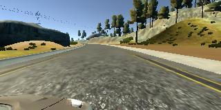
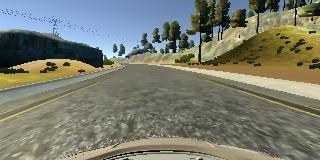
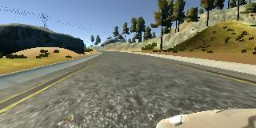
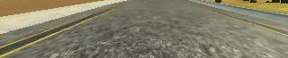
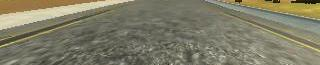
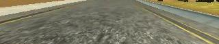
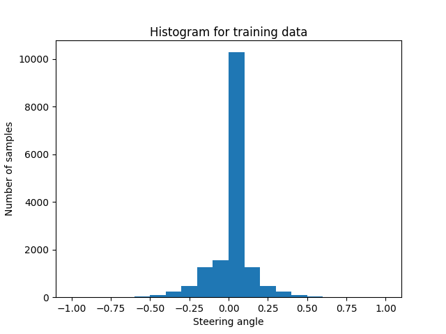
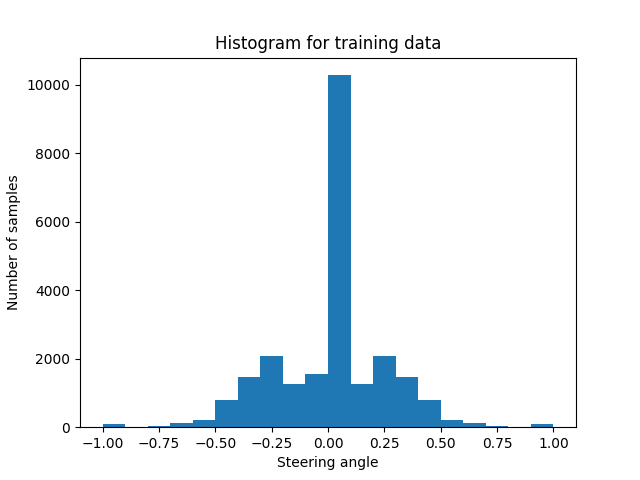
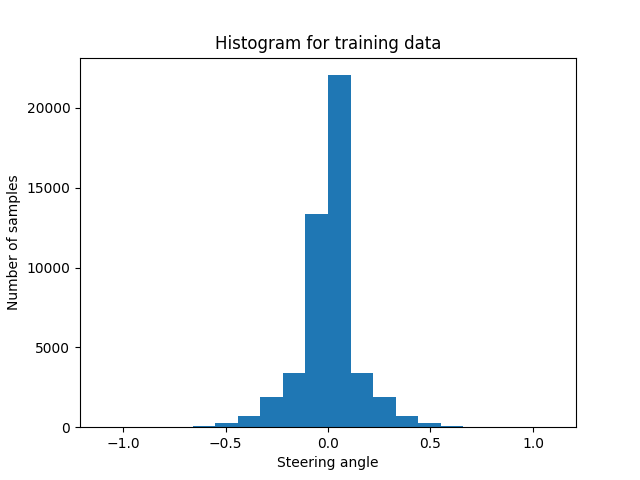

# **Behavioral Cloning**

## Writeup Template

---

**Behavioral Cloning Project**

The goals / steps of this project are the following:
* Use the simulator to collect data of good driving behavior
* Build, a convolution neural network in Keras that predicts steering angles from images
* Train and validate the model with a training and validation set
* Test that the model successfully drives around track one without leaving the road
* Summarize the results with a written report

## Rubric Points
### This section will describe how the each of the [rubric points](https://review.udacity.com/#!/rubrics/432/view) were addressed in this project.  

---
### Files Submitted & Code Quality

#### 1. Submission includes all required files and can be used to run the simulator in autonomous mode

The project submission includes the following files:
* model.py containing the script to create and train the model
* drive.py for driving the car in autonomous mode
* model.h5 containing a trained convolution neural network
* project_report.md containing the writeup for this project

#### 2. Submission includes functional code
Using the Udacity provided simulator and my drive.py file, the car can be driven autonomously around the track by executing
```sh
python drive.py model.h5
```

#### 3. Submission code is usable and readable

The model.py file contains the code for training and saving the convolution neural network. The file shows the pipeline that was used for training and validating the model, and it contains comments to explain how the code works.

### Model Architecture and Training Strategy

#### 1. An appropriate model architecture has been employed

The model used in this project is based on the model described in this [NVIDIA's paper](https://arxiv.org/pdf/1604.07316.pdf) titled *End to End Learning for Self-Driving Cars*. It was chosen because  it has an objective that is similar to the objective of the current project (i.e., training a neural network on images captured from a car). The figure below provides the structure of the NVIDIA model:

<p align="center">

</p>
<p align="center">
<em> NVIDIA network architecture.
</p>

The NVIDIA model was modified for the present project, as described later in this report.

#### 2. Attempts to reduce overfitting in the model

The extent of overfitting is analyzed by looking at :

* The performance of the model on the train/validation datasets.
* The performance of the model for different graphics quality settings.

The simulator provided for the project comes with several resolution and graphics quality settings as shown below:

<p align="center">

</p>
<p align="center">
<em> Resolution and speed settings for the simulator
</p>

Due to paucity of time and resources, only the smallest screen resolution (640x480) was tested. The trained models were found to work best with the the fastest graphics quality option (possibly because that was the setting in which the training data was generated). Besides looking at train/validation accuracy, another way to test for overfitting
would be to look at the performance of the data for different graphics quality settings.
If a model performs well on many graphics settings, it may be expected to generalize better.

The first architecture that was tested was similar to the NVIDIA architecture which used three 5x5 convolutional layers and two 3x3 convolutional layers. However, while the model
generated using this architecture was successful on the original track at the fastest speed setting, it did not work as well for the same track but using alternate
graphics quality settings. The fact that the model did not work for different graphics quality settings, shows that it may be overfitting to the original training data. Also, the model had too many parameters (95,471,419). The accuracy on the train and validation data for this architecture is provided below:

```
38572/38572 [==============================] - 832s 22ms/step - loss: 0.0665 - val_loss: 0.0114
Epoch 2/5
38572/38572 [==============================] - 814s 21ms/step - loss: 0.0107 - val_loss: 0.0114
Epoch 3/5
38572/38572 [==============================] - 813s 21ms/step - loss: 0.0102 - val_loss: 0.0110
Epoch 4/5
38572/38572 [==============================] - 812s 21ms/step - loss: 0.0098 - val_loss: 0.0111
Epoch 5/5
38572/38572 [==============================] - 815s 21ms/step - loss: 0.0094 - val_loss: 0.0113
```

The difference in accuracy between the train and validation data shows that the model is overfitting to the train data. Also, the validation data accuracy starts worsening after the
third epoch, indicating that there may be no need to train beyond three epochs.

One way to reduce overfitting is to reduce the size of the neural network. As a first step,
the last convolutional layer was removed. The model obtained from this architecture also
cleared the track with the fastest graphics quality setting but failed at more advanced
graphics quality settings. Next, the last two convolutional layers were removed. With this
setting, the model cleared the track for all the graphics quality settings. This was chosen to be the final configuration since eliminating further convolutional layers made the model perform poorly
on the track even for the fastest graphics quality setting. Compared to the original model (95,471,419 parameters), the final model had only 78,427,579 parameters (i.e., 18% reduction).

Shown below the performance of this final architecture on the train/validation data:
```
38572/38572 [==============================] - 541s 14ms/step - loss: 0.0710 - val_loss: 0.0115
Epoch 2/5
38572/38572 [==============================] - 530s 14ms/step - loss: 0.0102 - val_loss: 0.0112
Epoch 3/5
38572/38572 [==============================] - 530s 14ms/step - loss: 0.0094 - val_loss: 0.0117
Epoch 4/5
38572/38572 [==============================] - 530s 14ms/step - loss: 0.0085 - val_loss: 0.0122
Epoch 5/5
38572/38572 [==============================] - 528s 14ms/step - loss: 0.0071 - val_loss: 0.0122
```

It can be seen that the model may be overfitting to the training data, especially after the second epoch. Since the
accuracy on validation data also worsens after the second epoch, the final version of the model
was taken to be the one after the second epoch. While dropout can be used to further reduce overfitting, since the above model performed well for all the graphics quality settings, it was chosen as the final architecture and the need to add dropout was not deemed absolutely necessary.

#### 3. Model parameter tuning

The model used an Adam optimizer, so the learning rate was not tuned manually. The default learning rate for the Adam optimizer is 0.001. The number of epochs was kept at 2 to
prevent overfitting as noted in the previous section.

#### 4. Appropriate training data

The training data used to train the model was wholly based on the dataset that was
provided as part of this project. Details of how this data was augmented is described
later in this report.

### Model Architecture and Training Strategy

#### 1. Solution Design Approach

As noted earlier, first iteration of the model used a convolutional neural network model similar to the [NVIDIA model](https://arxiv.org/pdf/1604.07316.pdf).
The model was trained initially on the center camera data and did not perform well. Through pre-processing (cropping and normalization) and data augmentation (flipping and adding additional camera views) and adjusting the neural network configuration, the model was improved till it
was able to drive autonomously around the track without leaving the road.

#### 2. Final Model Architecture

The final model architecture consisted of a convolutional neural network with the following layers and layer sizes:

| Layer         		|     Description	        					|
|-----------------------|-----------------------------------------------|
| Input         		| 160x320x3 RGB image   							|
| Lambda      	| Normalize input as (image - 128.0)/128.0 	|
| Cropping      	| 70 pixels from top and 25 pixels from bottom , output dimensions  =(65,320,3)	|
| Convolution 5x5	    |  1x1 stride, valid padding, output dimensions = (61,316,24) |
| RELU					|												|
| Convolution 5x5	    |  1x1 stride, valid padding, output dimensions=(57,312,36) |
| RELU					|												|
| Convolution 5x5	    |  1x1 stride, valid padding, output dimensions=(53,308,48) |
| RELU					|												|
| Flatten		| output dimensions = 53x308x48 = 783552 |
| Fully connected		| output dimensions = 100 |
| RELU					|												|
| Fully connected		| output dimensions = 50 |
| RELU					|												|
| Fully connected		| output dimensions = 10 |
| RELU					|												|
| Output		| output dimensions = 1        									|

Since this is a regression problem, the loss function was chosen to be mean square error.
Here is a visualization of the architecture.

<p align="center">

</p>
<p align="center">
<em> Visualization of final neural network architecture
</p>

Note that the visualization does not include the pre-processing steps (normalization
  and cropping) and starts with the output of the cropping step (i.e., 65x320x3 image).

#### 3. Creation of the Training Set & Training Process

Without a joystick, manually generating new data by driving through the track
using mouse/keyboard controls was challenging. Fortunately,
there was some training data provided as part of the project
and this was found to be adequate to train the model to
successfully meet the criteria.

The original data set had totally 24,108 images. Because the track has a an anti-clockwise bias, all the images were flipped about the vertical axis to remove
the bias.
This increased the size of the dataset by a factor of two. The steering measurement
for the flipped image is obtained by changing the sign of the steering value for the
original image. Shown below are sample camera images before and after flipping:

<p align="center">


</p>
<p align="center">
<em> Left, center and right images before flipping
</p>

<p align="center">



</p>
<p align="center">
<em> Left, center and right images after flipping
</p>

For the model to predict the correct steering angle, only some portions of the image are relevant. For the most part, the top part of the image typically contains background information such as trees, sky, mountain, etc. These are not critical for making steering
control decisions. Also, the bottom part of the image contains part of the dashboard which,
again, is irrelevant for making steering control decisions. The dashboard adds noise to the image,
especially because the location of the dashboard is different for different cameras views (left, right and center). Therefore, it makes sense to crop out a some of the lower pixels
in the image as well. As part of the pre-processing step, 70 pixels were removed from
the top and 25 pixels were removed from the bottom. Sample images before and after
cropping are shown below:

<p align="center">


</p>
<p align="center">
<em> Left, center and right images before cropping
</p>

<p align="center">



</p>
<p align="center">
<em> Left, center and right images after cropping
</p>

It is seen that before cropping, it is easy to distinguish between the left, center
and right cameras whereas after cropping this is not easy because the dashboard has
been cropped off.

Since the steering angle provided with the pre-existing dataset corresponds to the
center camera, the first attempt at training the model used only the data from the
center camera. However, the model trained only on the center camera performed poorly.
The figure below shows the distribution training samples across different steering
angles:

<p align="center">

</p>
<p align="center">
<em> Histogram of center camera data alone
</p>

It can be seen that most of the data is available only for low steering angles.
This may bias the model to prefer low steering angles even when higher steering angles
may be required. Higher steering angles are all the more important because they are
needed at key turns where inaccuracies could lead to failure. To remove this bias, an attempt was made to augment the center camera
data by adding more images. In this approach, images that had low steering angles (< 0.25)
were not augmented while images with large steering angles were augmented proportionate
the magnitude of the steering angle. The function for creating an augmented image by
adding noise is provided below:

```python
def add_noise(input_image, mean=0, var=10):
    sigma = var ** 0.5
    gaussian = np.random.normal(mean, sigma, input_image.shape)
    noisy_image = np.zeros(input_image.shape, np.float32)
    noisy_image[:, :, :] = input_image[:, :, :] + gaussian
    cv2.normalize(noisy_image, noisy_image, 0, 255, cv2.NORM_MINMAX, dtype=-1)
    noisy_image = noisy_image.astype(np.uint8)

    return noisy_image

def expand_dataset(X_input, y_input, threshold=0.25):
    X_duplicate = []
    y_duplicate = []
    for i in range(len(y_input)):
        i_input = i       
        y_input_val = abs(y_input[i])
        if y_input_val > threshold:
            augment_factor = int(16*abs(y_input_val))
        else:
            augment_factor = 0

        for _ in range(augment_factor):
            X_duplicate.append(add_noise(X_input[i_input, :, :, :]))
            y_duplicate.append(y_input[i_input])

    return X_duplicate, y_duplicate
```

The histogram obtained after augmenting the center camera data is provided below:

<p align="center">

</p>
<p align="center">
<em> Histogram of center camera data after augmenting larger steering angles
</p>

However, despite the augmentation, the newly trained model still performed poorly, especially
at sharp turns. It was felt that the center camera data alone was not enough to train
the model to work successfully and that using of the images from the left and right cameras was critical
for the model to work. Some reasons why the left and right camera images were necessary
are listed below:

* The left and right cameras provide a lot more training data without artificial image
augmentation.

* The center camera only captures views of the road when driver is driving optimally. If
the car veers to the edge of the road, the center camera alone does not contain sufficient data on how
to recover from such situations. The left and right cameras on the other hand, contain
perspectives of the road that would be seen from the center camera if the car veers of
to the edges of the road. Therefore, by including images from the left and right cameras
and attributing suitable steering values for these images, we provide training on how
to recover from mistakes and edge behavior.

* Since the steering angles for the left and right cameras are obtained by adding a correction
factor to the center camera steering angle, the distribution of samples across steering
angles is improved by increasing the number samples with higher steering angles. This can be seen in the histogram below:

The histogram obtained after augmenting the center camera data with left and right camera data is provided below:
<p align="center">

</p>
<p align="center">
<em> Histogram of dataset after including left and right cameras
</p>

However, one challenge when including left and right camera images is that when the model is tested, the data provided to the model
is only the center camera image. Therefore, the steering angles used for the left and right camera images during training must be adjusted to make it correspond to that of a center camera. A steering correction factor is used to assign a suitable value for the left
and right camera image based on the value for the corresponding center camera image. The
steering correction factor is applied as shown in the code snippet below:

```python
steering_left = steering_center + steering_correction
steering_right = steering_center - steering_correction
```

The steering correction factor is a hyper-parameter that needs to be tuned. For this project,
a value of 0.1 was found to work well. Provided below is an example image of left, center and
right lane driving:

<p align="center">


</p>
<p align="center">
<em> Sample image before (left) and after (right) adding noise
</p>

Including the left and right camera images and including flipping, increased the size of
the dataset to 48,324. This was randomly shuffled and 80% was used as training data and 20% was used as validation data. One concern with processing a large number images is that it
might no fit the computers memory. In such situations one solution is to use python generators to dynamically generating data without having to train it. However, for the present
project, the provided workspace was adquate and there was no need to use generators.

### Video of Final Result

The trained model was able to successfully complete a complete lap on the test track for different graphics quality settings.

The video showing successful track completion for the fastest (poorest) graphics quality setting can be seen at the link below:

[](https://youtu.be/El8aMeZu4p4)

The video showing successful track completion for the highest graphics quality setting can be seen at the link below:
[](https://youtu.be/apx4SyRc8tY)
